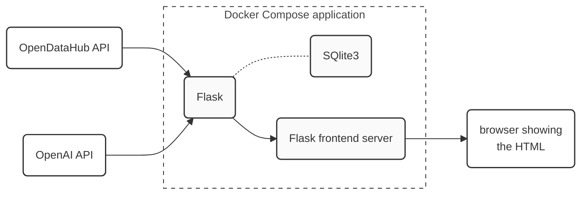

# wavelab_challenge
NOI HACKATHON weblab_challenge

## Intro

This end-to-end Docker Compose application, which aims to provide a useful recreational opportunity for users waiting for their electric vehicle to be fully charged. It uses up-to-date data from the [Open Data Hub (ODH)] (https://opendatahub.it) to optimise the OpenAi GPT-4o through Retrieval-Augmented Generation (RAG) in order to provide suggestions based on the user's preference, availability of events, activities, weather and distance between the user and the point of interest. The application uses the Falsk framework to provide optimal interaction.

## Installation
This Docker Compose application involves building custom images for its Python processor components.

Clone this repository and copy `.env.example` into `.env`, possibly editing it (just creating `.env` is enough):
  ```bash
  $  git clone https://github.com/giusber2005/wavelab_challenge.git
  $  cd wavelab_challenge
  $  cp .env.example .env
  ```

## Usage
In a terminal, use Docker Compose to start or stop all the required components.
  ```bash
  $  docker compose up                        # to start the application
  $  docker compose down -v --remove-orphans  # to stop the application
  ```

Once the application is up and running, you can access the chat and strting your query by:
- Open your web browser and go to http://localhost:5000.
- You will be presented with a flask web interface showing the chat, the platform is alredy also design to work on mobile.
- The data is updated at the first propt retriving the daily actraction and the weather forcast for the next three hours.
- Explore the different options by continius to chat with the boot and specify all your needs.

## Architecture


The figure shows the application architecture in terms of components and data flow (solid links):

The application uses current data from the [Open Data Hub] (https://opendatahub.it). Loads the :
* Weather forecast for the next 3 hours 
* Activity based on the season
* Events happening during the day 
* Distance between EV charging station and POI

The information is collected and stored to create a data set used to run RAG with the GPT-4o model.
The props for the LLm are tailored so that the models are limited in the hallucination, and do not drive away from the conversation.
The conversation is stored in a SQlite database to further fine tune the model with enough user preferences.

## Licence

MIT